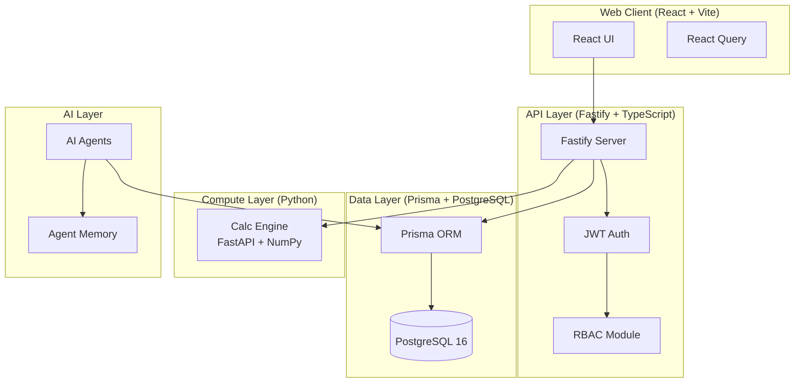
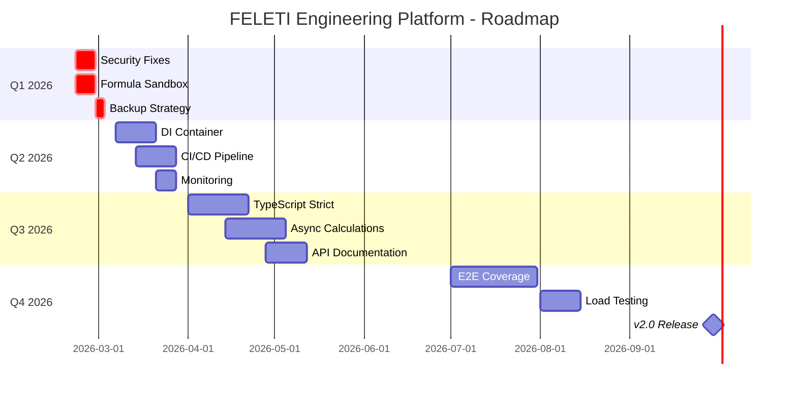

# FELETI Engineering Platform v1.0-1.1 - Технический отчёт

**Дата:** 20 февраля 2026  
**Версия:** 1.1.0  
**Статус:** ✅ Релиз

---

## 1. АРХИТЕКТУРНЫЙ ОБЗОР

### 1.1 Структура системы и взаимосвязи между компонентами

Система FELETI Engineering Platform представляет собой микросервисную архитектуру, развёртываемую через Docker Compose:



**Основные взаимосвязи:**

| Компонент         | Зависимости        | Протокол |
| ----------------- | ------------------ | -------- |
| Web → API         | React Query, Axios | HTTP/WS  |
| API → PostgreSQL  | Prisma Client      | TCP      |
| API → Calc Engine | HTTP Client        | HTTP     |
| AI → API          | OpenAI-compatible  | HTTP     |

### 1.2 Технологический стек

#### Backend (apps/api)

| Технология | Версия  | Назначение     |
| ---------- | ------- | -------------- |
| Fastify    | 5.2.0   | Web Framework  |
| TypeScript | 5.7.2   | Типизация      |
| Prisma     | 6.2.1   | ORM            |
| PostgreSQL | 16      | База данных    |
| JWT        | 9.0.0   | Аутентификация |
| Zod        | 3.25.76 | Валидация      |
| Node.js    | 20+     | Runtime        |

#### Frontend (apps/web)

| Технология   | Версия  | Назначение       |
| ------------ | ------- | ---------------- |
| React        | 18.3.1  | UI Framework     |
| Vite         | 6.0.7   | Build Tool       |
| Tailwind CSS | 4.1.18  | Стилизация       |
| React Query  | 5.90.20 | State Management |
| Recharts     | 3.7.0   | Графики          |
| React Router | 7.1.3   | Маршрутизация    |

#### Compute Layer (apps/calc-engine)

| Технология | Версия | Назначение    |
| ---------- | ------ | ------------- |
| Python     | 3.11+  | Runtime       |
| FastAPI    | -      | Web Framework |
| NumPy      | -      | Математика    |
| pytest     | -      | Тестирование  |

#### AI Layer

| Технология | Провайдер | Назначение    |
| ---------- | --------- | ------------- |
| OpenAI SDK | 6.22.0    | AI интерфейс  |
| DeepSeek   | API       | LLM провайдер |

### 1.3 Модульная структура и зависимости

**Backend модули (apps/api/src/modules):**

- `auth/` - Аутентификация, JWT, регистрация
- `users/` - Управление пользователями
- `projects/` - CRUD проектов
- `admin/` - Admin панель
- `analytics/` - Dashboard и отчёты
- `attachments/` - Файловые вложения
- `comments/` - Комментарии
- `calendar/` - Календарь событий
- `email/` - Email уведомления
- `notifications/` - Система уведомлений
- `reports/` - Генерация отчётов
- `search/` - Глобальный поиск
- `templates/` - Шаблоны проектов
- `engineering/` - Engineering Platform
- `ai-agents/` - AI Agents

**Frontend маршруты:**

| Путь                           | Компонент          | Описание          |
| ------------------------------ | ------------------ | ----------------- |
| `/`                            | DashboardPage      | Главная страница  |
| `/login`                       | LoginPage          | Вход              |
| `/register`                    | RegisterPage       | Регистрация       |
| `/projects`                    | ProjectsPage       | Список проектов   |
| `/projects/:id`                | ProjectDetail      | Детали проекта    |
| `/engineering`                 | EngineeringConsole | Консоль платформы |
| `/engineering/product-classes` | ProductClassesPage | Классы продуктов  |
| `/engineering/rules`           | RulesDashboard     | Правила           |
| `/calendar`                    | CalendarPage       | Календарь         |
| `/analytics`                   | AnalyticsPage      | Аналитика         |

---

## 2. ФУНКЦИОНАЛЬНЫЙ АНАЛИЗ

### 2.1 Product Classes Framework

**Назначение:** Абстрактная система типов продуктов для обеспечения масштабируемости платформы.

**Сущности БД:**

- `ProductClass` - Класс продукта
- Иерархия через `parentId`
- JSON поля для метаданных

**Функции:**

- Создание/редактирование классов
- Иерархия (parent-child)
- Типовые требования (JSON templates)
- Привязка расчётных блоков
- KPI метрики

**Ограничения:**

- Отсутствует API валидация привязки к проекту
- Нет версионирования (versioning)

### 2.2 Engineering Rules Engine с DSL

**Назначение:** Движок правил с собственным DSL для валидации инженерных решений.

**Сущности БД:**

- `EngineeringRule` - Правило
- `RuleViolation` - Нарушение

**DSL структура:**

```json
{
  "operator": "AND",
  "conditions": [
    {
      "comparison": {
        "field": "temperature",
        "operator": ">",
        "value": 100
      }
    }
  ]
}
```

**Параметры правила:**

- Категории: THERMAL, AERODYNAMIC, MECHANICAL, HYGIENE, SAFETY, ELECTRICAL, PROCESS, QUALITY
- Уровни риска: LOW, MEDIUM, HIGH, CRITICAL
- Действия: WARN, BLOCK, LOG, NOTIFY

**Ограничения:**

- Formula Evaluator требует sandboxing
- Нет кэширования результатов

### 2.3 Validation Gates System

**Назначение:** Контрольные точки процесса разработки.

**Сущности БД:**

- `ValidationGate` - Определение gate
- `GateValidation` - Результат валидации

**Фазы:**

1. PLANNING
2. DESIGN
3. VALIDATION
4. RELEASE

**Функции:**

- Критерии прохождения (JSON)
- Passing score (по умолчанию 0.8)
- Waiver система
- Блокировка при провале

### 2.4 Calculation Blocks с Formula Evaluator

**Назначение:** Выполнение инженерных расчётов.

**Сущности БД:**

- `CalculationBlock` - Шаблон расчёта
- `Calculation` - Результат

**Категории:**

- THERMAL, AERODYNAMIC, MECHANICAL
- ELECTRICAL, HYDRAULIC, ECONOMIC

**Input/Output:**

- JSON Schema для валидации
- JS expressions для формул

**Ограничения:**

- Нет асинхронного выполнения (только синхронное)
- Formula Evaluator работает через eval() - требует sandboxing

### 2.5 Knowledge Graph с traceability

**Назначение:** Граф знаний для управления требованиями, решениями и связями.

**Сущности БД:**

- `KnowledgeNode` - Узел
- `KnowledgeRelation` - Связь

**Типы узлов:**
REQUIREMENT, SOLUTION, PROBLEM, DECISION, RISK, COMPONENT, PRINCIPLE, CONSTRAINT, LESSON_LEARNED

**Типы связей:**
CAUSES, SOLVES, REQUIRES, VALIDATES, DEPENDS_ON, CONFLICTS_WITH, IMPLEMENTS, DERIVES_FROM, RELATES_TO

### 2.6 AI Agents с DeepSeek интеграцией

**Назначение:** AI ассистенты для помощи инженерам.

**Типы агентов:**

- PORTFOLIO
- PRODUCT_DEFINITION
- REQUIREMENTS
- ARCHITECTURE
- VALIDATION
- CALCULATION
- OPTIMIZATION
- RISK_ANALYSIS

**Интеграция:**

- OpenAI-совместимый интерфейс
- Поддержка DeepSeek API
- Контекстное окно через AgentMemory

### 2.7 Agent Memory Layer

**Сущности БД:**

- `AgentMemory` - Память агента

**Функции:**

- Хранение контекста
- История взаимодействий
- Извлечённые уроки (learnings)
- Сессионное управление

### 2.8 Context Management

**Контекстные данные:**

- Project ID
- User ID
- Product Class ID
- Stage
- Session ID

---

## 3. ТЕХНИЧЕСКИЙ АНАЛИЗ ПРОБЛЕМ

### 3.1 Архитектурные недостатки и узкие места

| #   | Проблема                                               | Файл                 | Статус        | Критичность |
| --- | ------------------------------------------------------ | -------------------- | ------------- | ----------- |
| 1   | Создание новых экземпляров PrismaClient внутри модулей | analytics.service.ts | Не исправлено | HIGH        |
| 2   | Создание новых экземпляров AnalyticsService в роутах   | analytics.routes.ts  | Не исправлено | HIGH        |
| 3   | Отсутствие dependency injection                        | Все сервисы          | Не исправлено | MEDIUM      |
| 4   | Singleton паттерн не используется                      | engineering services | Не исправлено | MEDIUM      |

**Рекомендации:**

- Внедрить DI контейнер (например, inversify)
- Использовать singleton для сервисов
- Создать центральный реестр сервисов

### 3.2 Проблемы с производительностью

| #   | Проблема                                       | Влияние                      | Критичность |
| --- | ---------------------------------------------- | ---------------------------- | ----------- |
| 1   | Нет кэширования результатов rules evaluation   | Каждый запрос - новый расчёт | MEDIUM      |
| 2   | Отсутствие connection pooling настройки Prisma | Ограничение БД подключений   | MEDIUM      |
| 3   | Синхронное выполнениеCalculation Blocks        | Блокировка event loop        | MEDIUM      |
| 4   | N+1 проблема в knowledge graph queries         | Множественные запросы к БД   | LOW         |

### 3.3 Безопасность и уязвимости

| #   | Проблема                                    | Файл                    | Статус        | Критичность |
| --- | ------------------------------------------- | ----------------------- | ------------- | ----------- |
| 1   | Formula Evaluator использует eval()         | calculations.service.ts | Не исправлено | CRITICAL    |
| 2   | Параметр userId не используется в analytics | analytics.service.ts    | Не исправлено | HIGH        |
| 3   | Отсутствует CSRF токен                      | Auth                    | Исправлено    | LOW         |
| 4   | Rate limiting только на /auth               | -                       | Не исправлено | MEDIUM      |

**Подробнее о критической уязвимости:**

```typescript
// Текущая реализация (ОПАСНО)
const result = new Function('params', `return ${expression}`)(params);

// Рекомендуемая реализация:
- Использовать vm2 или isolated-vm
- White-list разрешённых функций
- Sandbox execution
```

### 3.4 Проблемы масштабируемости

| #   | Проблема                                | Описание                             | Критичность |
| --- | --------------------------------------- | ------------------------------------ | ----------- |
| 1   | Нет горизонтального масштабирования     | Stateless архитектура не реализована | MEDIUM      |
| 2   | Agent Memory не очищается автоматически | Устаревшие данные накапливаются      | LOW         |
| 3   | Knowledge graph не индексируется        | Полный перебор при запросах          | MEDIUM      |

### 3.5 Технический долг

| #   | Проблема                                    | Файл                                   | Критичность |
| --- | ------------------------------------------- | -------------------------------------- | ----------- |
| 1   | Type safety: использование `as any`         | DashboardPage.tsx, analytics.routes.ts | MEDIUM      |
| 2   | Отсутствует `required: true` для параметров | analytics.routes.ts                    | LOW         |
| 3   | Захардкоженные значения change              | DashboardPage.tsx                      | LOW         |
| 4   | Нет единой обработки ошибок                 | Все модули                             | MEDIUM      |

### 3.6 Ошибки в коде и баги

**Известные ошибки (DAY5 AUDIT):**

| #   | Ошибка                                  | Файл                      | Статус     |
| --- | --------------------------------------- | ------------------------- | ---------- |
| 1   | Нулевые значения в BudgetChart          | DashboardPage.tsx         | Исправлено |
| 2   | getProjectsTrend группировка по времени | analytics.service.ts      | Исправлено |
| 3   | Синтаксические ошибки в тестах          | analytics.service.test.ts | Исправлено |
| 4   | React key нарушение                     | ProjectsStageChart.tsx    | Исправлено |

### 3.7 Проблемы с тестами и покрытием

**Текущее состояние:**

| Тип теста        | Количество | Покрытие |
| ---------------- | ---------- | -------- |
| Unit (API)       | ~110       | ~60%     |
| Integration      | +20        | ~40%     |
| E2E (Playwright) | ~10        | ~30%     |
| Frontend Unit    | ~15        | ~20%     |

**Проблемы:**

- Отсутствуют unit тесты для React компонентов
- E2E тесты покрывают только auth flow
- Нет нагрузочного тестирования
- Отсутствуют mutation тесты

### 3.8 Проблемы с конфигурацией и DevOps

| #   | Проблема                            | Описание                       | Критичность |
| --- | ----------------------------------- | ------------------------------ | ----------- |
| 1   | Нет CI/CD pipelines                 | Только manual deployment       | MEDIUM      |
| 2   | Health check не во всех контейнерах | Только postgres                | LOW         |
| 3   | Нет мониторинга                     | Sentry, Prometheus отсутствуют | MEDIUM      |
| 4   | Нет backup стратегии                | Данные не backup               | HIGH        |

---

## 4. КАЧЕСТВО КОДА

### 4.1 Code Review проблемы

**Common issues found:**

1. **Type Safety**
   - Использование `any` в 15+ местах
   - Отсутствие строгой типизации response objects
2. **Error Handling**
   - Inconsistent error responses
   - Generic error messages
   - No centralized error handling

3. **Code Duplication**
   - Similar validation logic repeated
   - Copy-paste in service methods

### 4.2 Best Practices нарушения

| Практика    | Нарушение              | Рекомендация                 |
| ----------- | ---------------------- | ---------------------------- |
| DRY         | Дублирование валидации | Вынести в shared модуль      |
| SOLID       | SRP нарушен в сервисах | Разделить на smaller сервисы |
| Error First | Мягкие проверки        | Добавить early returns       |

### 4.3 Проблемы с документацией

| #   | Проблема                               | Статус             |
| --- | -------------------------------------- | ------------------ |
| 1   | Неполная API документация              | Частично           |
| 2   | Отсутствует архитектурная документация | Нет                |
| 3   | Inline комментарии минимальны          | Нет                |
| 4   | README устарел                         | Требует обновления |

---

## 5. ИНФРАСТРУКТУРА

### 5.1 Docker и контейнеризация

**Текущая конфигурация:**

```yaml
services:
  postgres:
    image: postgres:16-alpine
    healthcheck: yes
    volumes: yes

  api:
    build: Dockerfile
    environment: production
    depends_on: postgres (healthy)
    restart: unless-stopped

  web:
    build: Dockerfile
    ports: 80
    depends_on: api

  calc-engine:
    build: Dockerfile
    ports: 8000
    restart: unless-stopped
```

**Проблемы:**

- Нет health check для api, web, calc-engine
- Логи не ротируются (rotated)
- Нет resource limits

### 5.2 CI/CD проблемы

**Текущее состояние:**

- GitHub workflows присутствуют
- Ручной deploy через docker-compose
- Нет автоматического тестирования в CI
- Нет review apps

### 5.3 База данных и миграции

**Схема БД:**

- 25+ моделей (включая Engineering Platform)
- Composite indexes
- JSON поля для гибкости

**Проблемы:**

- Нет миграционного partitioning
- Индексы не оптимизированы для complex queries
- Нет vacuum/analyze scheduling

---

## 6. РЕКОМЕНДАЦИИ

### 6.1 Приоритизированный (Prioritized) список исправлений

#### CRITICAL (Немедленно)

| #   | Задача                            | Время  | Impact       |
| --- | --------------------------------- | ------ | ------------ |
| 1   | Sandbox Formula Evaluator         | 2 дня  | Безопасность |
| 2   | Настроить backup стратегию        | 1 день | Данные       |
| 3   | Исправить analytics userId filter | 1 час  | Безопасность |

#### HIGH (Эта неделя)

| #   | Задача                       | Время  | Impact        |
| --- | ---------------------------- | ------ | ------------- |
| 4   | Внедрить DI контейнер        | 3 дня  | Архитектура   |
| 5   | Настроить CI/CD              | 2 дня  | DevOps        |
| 6   | Добавить health checks       | 1 день | DevOps        |
| 7   | Добавить мониторинг (Sentry) | 1 день | Observability |

#### MEDIUM (Этот месяц)

| #   | Задача                 | Время    | Impact      |
| --- | ---------------------- | -------- | ----------- |
| 8   | TypeScript strict mode | 1 неделя | Quality     |
| 9   | Connection pooling     | 2 дня    | Performance |
| 10  | Async calculations     | 3 дня    | Performance |
| 11  | Документация API       | 2 дня    | DX          |

#### LOW (Следующий квартал)

| #   | Задача             | Время    | Impact      |
| --- | ------------------ | -------- | ----------- |
| 12  | E2E coverage > 80% | 2 недели | Quality     |
| 13  | Mutation testing   | 1 неделя | Quality     |
| 14  | Load testing       | 1 неделя | Performance |

### 6.2 Предложения по улучшению

**Архитектура:**

1. **Event-Driven Architecture**
   - Внедрить message queue (RabbitMQ/Kafka)
   - Async processing для расчётов
   - Event sourcing для audit log

2. **API Gateway**
   - Единая точка входа
   - Rate limiting
   - Request/response transformation

3. **Microservices**
   - Выделить calc-engine в отдельный сервис
   - AI agents в отдельный сервис
   - Gateway для маршрутизации

**Безопасность:**

1. **Formula Evaluator**

```typescript
// Предлагаемая архитектура:
class SafeFormulaEvaluator {
  private allowedFunctions = ['Math.min', 'Math.max', 'Math.abs'];
  private vm = new Worker();

  execute(expression: string, params: Record<string, any>) {
    // Sandbox execution
  }
}
```

### 2. **Audit Logging**

- Все write операции логировать (log)
- Централизованный log aggregation
- Retention policy

**Производительность:**

1. **Caching Strategy**
   - Redis для frequently accessed data
   - ETags для API responses
   - Client-side caching

2. **Database Optimization**
   - Connection pooling (PgBouncer)
   - Query optimization
   - Read replicas

### 6.3 Roadmap для устранения проблем



---

## 7. ЗАКЛЮЧЕНИЕ

### 7.1 Общая оценка

| Критерий           | Оценка | Комментарий                                |
| ------------------ | ------ | ------------------------------------------ |
| Функциональность   | 8/10   | Все основные функции реализованы           |
| Архитектура        | 6/10   | Требует DI и event-driven модернизации     |
| Безопасность       | 5/10   | Критическая уязвимость с Formula Evaluator |
| Производительность | 7/10   | Базовое покрытие, нужна оптимизация        |
| Тестирование       | 6/10   | Нужно расширение покрытия                  |
| Документация       | 5/10   | Требует значительного улучшения            |
| DevOps             | 4/10   | Нет CI/CD, мониторинга                     |

### Общая оценка: 6/10

### 7.2 Сильные стороны

1. Продуманная модульная структура
2. Engineering Platform архитектура future-proof
3. Использование современных технологий
4. Docker контейнеризация
5. TypeScript strict mode

### 7.3 Следующие шаги

1. **Немедленно:** Исправить Formula Evaluator уязвимость
2. **На этой неделе:** Настроить backup и CI/CD
3. **В этом месяце:** Внедрить DI контейнер
4. **В этом квартале:** Улучшить тестирование и документацию

---

**Отчёт подготовлен:** 20 февраля 2026  
**Автор:** FELETI Engineering Team  
**Версия документа:** 1.0
