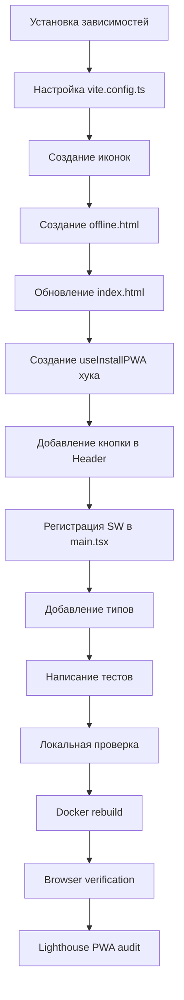

# День 16: PWA - Progressive Web App

## 📋 План внедрения

### Текущее состояние проекта

**Изученные файлы:**

- [`vite.config.ts`](apps/web/vite.config.ts) - базовая конфигурация Vite + React + Tailwind
- [`index.html`](apps/web/index.html) - минимальный HTML без PWA мета-тегов
- [`package.json`](apps/web/package.json) - нет зависимостей для PWA
- [`main.tsx`](apps/web/src/main.tsx) - нет регистрации Service Worker
- [`Header.tsx`](apps/web/src/components/layout/Header.tsx) - готов для добавления кнопки установки
- `public/` - **пустая директория**, нужно создать иконки

---

## 🎯 Что получим после внедрения

| Функция       | Описание                                       |
| ------------- | ---------------------------------------------- |
| 📱 Установка  | Приложение можно установить на телефон/десктоп |
| ⚡ Кэш        | Быстрая загрузка из кэша статики и API         |
| 📵 Офлайн     | Красивая страница при отсутствии сети          |
| 🔄 Обновления | Автоматическое обновление Service Worker       |
| 🎨 Splash     | Нативный сплэш-скрин при запуске               |

---

## 📝 Детальный план

### ШАГ 1: Установка зависимостей

```powershell
npm install --workspace=apps/web -D vite-plugin-pwa
npm install --workspace=apps/web workbox-window
```

**Результат:**

- `vite-plugin-pwa` - плагин для генерации Service Worker и манифеста
- `workbox-window` - библиотека для управления SW в браузере

---

### ШАГ 2: Настройка vite.config.ts

**Файл:** [`apps/web/vite.config.ts`](apps/web/vite.config.ts)

**Изменения:**

1. Импортировать `VitePWA` из `vite-plugin-pwa`
2. Добавить плагин в массив `plugins[]`
3. Настроить манифест:
   - Название: FELETI R&D
   - Цвета: theme_color #1e3a5f, background #0f172a
   - Иконки: 64x64, 192x192, 512x512, maskable
   - Shortcuts: Дашборд, Проекты, Калькуляторы
4. Настроить Workbox:
   - Кэш статики: js, css, html, ico, png, svg, woff2
   - API: NetworkFirst с таймаутом 10 сек
   - Изображения: CacheFirst на 1 день
   - Офлайн страница: /offline.html

---

### ШАГ 3: Создание иконок PWA

**Директория:** `apps/web/public/`

**Необходимые файлы:**

| Файл                        | Размер  | Назначение        |
| --------------------------- | ------- | ----------------- |
| `favicon.ico`               | 48x48   | Иконка в браузере |
| `pwa-64x64.png`             | 64x64   | Маленькая иконка  |
| `pwa-192x192.png`           | 192x192 | Android иконка    |
| `pwa-512x512.png`           | 512x512 | Android большая   |
| `maskable-icon-512x512.png` | 512x512 | Android maskable  |
| `apple-touch-icon.png`      | 180x180 | iOS иконка        |
| `masked-icon.svg`           | SVG     | Safari mask-icon  |

**Способ создания:**

1. Создать SVG-шаблон с логотипом FELETI R&D
2. Использовать онлайн-генератор ([pwa-image-generator.vercel.app](https://pwa-image-generator.vercel.app/))
3. Или использовать пакет `@vite-pwa/assets-generator`

---

### ШАГ 4: Создание офлайн страницы

**Файл:** `apps/web/public/offline.html`

**Содержимое:**

- Красивый дизайн в стиле приложения
- Сообщение "Нет подключения к сети"
- Кнопка "Попробовать снова"
- Автовозврат при восстановлении соединения
- Темная тема (соответствует приложению)

---

### ШАГ 5: Обновление index.html

**Файл:** [`apps/web/index.html`](apps/web/index.html)

**Добавить мета-теги:**

```html
<!-- PWA мета теги -->
<meta name="theme-color" content="#1e3a5f" />
<meta name="mobile-web-app-capable" content="yes" />
<meta name="apple-mobile-web-app-capable" content="yes" />
<meta name="apple-mobile-web-app-status-bar-style" content="black-translucent" />
<meta name="apple-mobile-web-app-title" content="FELETI R&D" />

<!-- SEO -->
<meta name="description" content="Система управления R&D проектами" />

<!-- Иконки -->
<link rel="icon" href="/favicon.ico" />
<link rel="apple-touch-icon" href="/apple-touch-icon.png" />
<link rel="mask-icon" href="/masked-icon.svg" color="#1e3a5f" />
```

---

### ШАГ 6: Создание хука useInstallPWA

**Файл:** `apps/web/src/hooks/useInstallPWA.ts`

**Функциональность:**

- Отслеживание события `beforeinstallprompt`
- Состояния: `isInstallable`, `isInstalled`
- Метод `install()` для показа диалога установки
- Определение режима `standalone` (уже установлено)

---

### ШАГ 7: Добавление кнопки установки в Header

**Файл:** [`apps/web/src/components/layout/Header.tsx`](apps/web/src/components/layout/Header.tsx)

**Изменения:**

1. Импортировать `useInstallPWA`
2. Добавить кнопку "Установить" (показывается если `isInstallable`)
3. Показывать "✅ Установлено" если уже установлено
4. Анимация пульсации для привлечения внимания

---

### ШАГ 8: Регистрация Service Worker

**Файл:** [`apps/web/src/main.tsx`](apps/web/src/main.tsx)

**Добавить:**

```typescript
import { registerSW } from 'virtual:pwa-register';

const updateSW = registerSW({
  onNeedRefresh() {
    if (confirm('Доступна новая версия. Обновить?')) {
      updateSW(true);
    }
  },
  onOfflineReady() {
    console.log('✅ Приложение готово к офлайн работе');
  },
});
```

---

### ШАГ 9: Добавление типов

**Файл:** [`apps/web/vite-env.d.ts`](apps/web/vite-env.d.ts)

**Добавить:**

```typescript
/// <reference types="vite-plugin-pwa/client" />
```

---

### ШАГ 10: Тесты

**Файл:** `apps/web/src/hooks/__tests__/useInstallPWA.test.ts`

**Тест-кейсы:**

1. Возвращает корректные начальные состояния
2. Обрабатывает событие `beforeinstallprompt`
3. Метод `install()` вызывает prompt
4. Определяет режим standalone

---

## 🔄 Workflow



---

## ✅ Критерии готовности

| Критерий               | Как проверить                            |
| ---------------------- | ---------------------------------------- |
| Service Worker активен | DevTools → Application → Service Workers |
| Манифест загружен      | DevTools → Application → Manifest        |
| Иконка установки       | Адресная строка Chrome → иконка ⊕        |
| Установка работает     | Нажать ⊕ → диалог → установка            |
| Офлайн страница        | DevTools → Network → Offline             |
| Lighthouse PWA         | DevTools → Lighthouse → PWA score > 80   |

---

## 📁 Файлы для создания/изменения

### Новые файлы

- `apps/web/public/favicon.ico`
- `apps/web/public/pwa-64x64.png`
- `apps/web/public/pwa-192x192.png`
- `apps/web/public/pwa-512x512.png`
- `apps/web/public/maskable-icon-512x512.png`
- `apps/web/public/apple-touch-icon.png`
- `apps/web/public/masked-icon.svg`
- `apps/web/public/offline.html`
- `apps/web/src/hooks/useInstallPWA.ts`
- `apps/web/src/hooks/__tests__/useInstallPWA.test.ts`

### Изменяемые файлы

- `apps/web/package.json` - добавить зависимости
- `apps/web/vite.config.ts` - добавить VitePWA плагин
- `apps/web/index.html` - добавить PWA мета-теги
- `apps/web/src/main.tsx` - регистрация SW
- `apps/web/vite-env.d.ts` - типы для PWA
- `apps/web/src/components/layout/Header.tsx` - кнопка установки

---

## 🚀 Команды для выполнения

```powershell
# 1. Установка зависимостей
npm install --workspace=apps/web -D vite-plugin-pwa
npm install --workspace=apps/web workbox-window

# 2. Локальная проверка
cd apps/web
npm run build
npx vite preview

# 3. Docker rebuild
docker-compose up --build web -d

# 4. Проверка в браузере
Start-Process "http://localhost"
```

---

## ⚠️ Важные замечания

1. **Иконки** - PNG иконки нужно создать вручную или через онлайн-генератор
2. **TDD** - сначала написать тесты для хука useInstallPWA
3. **Browser verification** - обязательно проверить в Chrome DevTools
4. **Mobile** - проверить установку на Android устройстве
5. **Удалить console.log** - из main.tsx после тестирования

---

_План создан: 2026-02-16_
_Режим: Architect_
