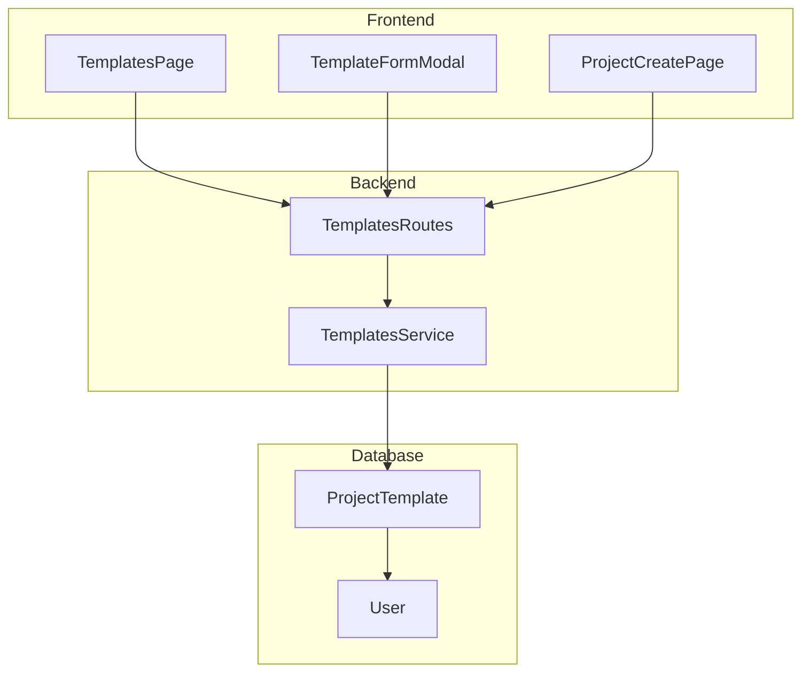
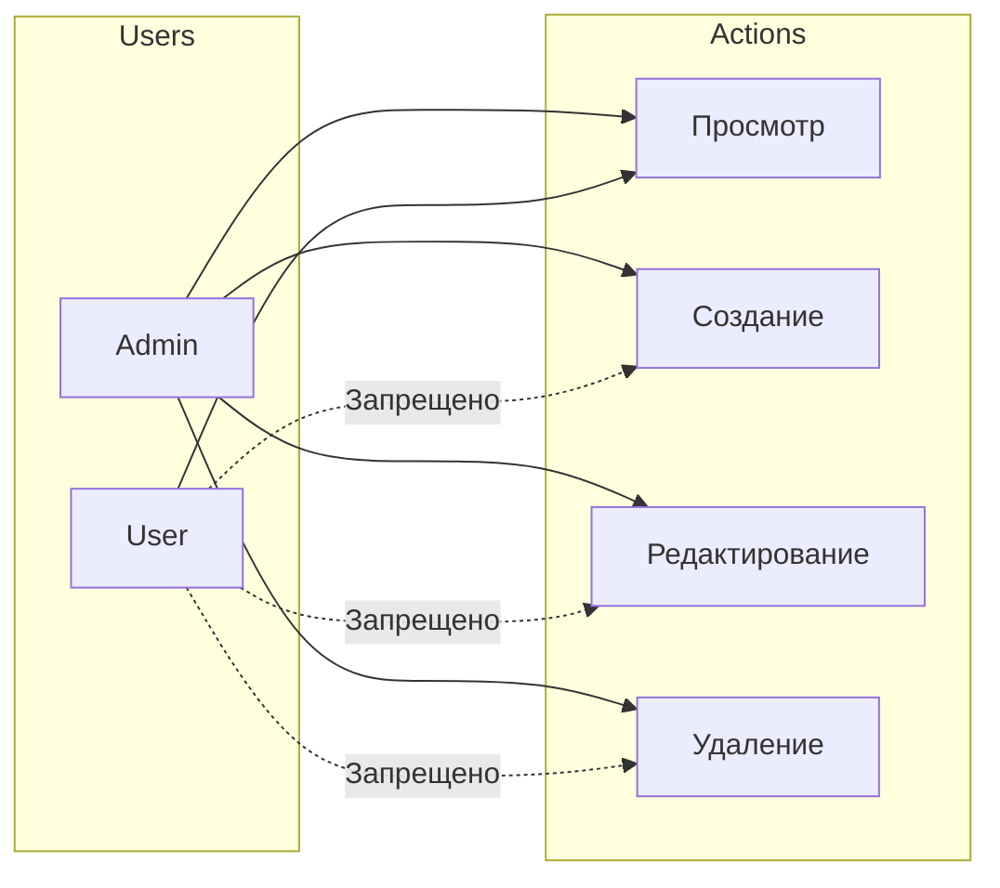

# День 21: Project Templates - План реализации

## 📋 Обзор задачи

Создание системы шаблонов проектов для быстрого создания типовых проектов в R&D системе.

## 🎯 Цели

- 📝 Создание шаблонов проектов с предустановленными параметрами
- 🎨 Просмотр списка шаблонов всеми пользователями
- ⚡ Быстрое создание проекта из шаблона
- ✏️ Редактирование шаблонов (только Admin)
- 🗑️ Удаление шаблонов (только Admin)
- 🔒 RBAC: только Admin создаёт/редактирует/удаляет шаблоны

## 📊 Что хранит шаблон

| Поле            | Тип           | Описание                                  |
| --------------- | ------------- | ----------------------------------------- |
| id              | String (UUID) | Уникальный идентификатор                  |
| name            | String        | Название шаблона                          |
| description     | String?       | Описание                                  |
| defaultStage    | String        | Стадия по умолчанию (IDEA, CONCEPT, etc.) |
| estimatedBudget | Decimal?      | Примерный бюджет                          |
| estimatedDays   | Int?          | Типичная длительность в днях              |
| teamSize        | Int?          | Типичный размер команды                   |
| checklist       | Json?         | Массив строк - список задач               |
| createdById     | String        | ID создателя (Admin)                      |
| createdAt       | DateTime      | Дата создания                             |
| updatedAt       | DateTime      | Дата обновления                           |

## 🏗️ Архитектура



## 📁 Структура файлов

### Backend (apps/api)

```text
apps/api/
├── prisma/
│   └── schema.prisma              # Добавить модель ProjectTemplate
├── src/
│   └── modules/
│       └── templates/
│           ├── templates.service.ts
│           ├── templates.routes.ts
│           └── __tests__/
│               └── templates.service.test.ts
└── server.ts                       # Зарегистрировать routes
```

### Frontend (apps/web)

```text
apps/web/src/
├── pages/
│   ├── TemplatesPage.tsx          # Новая страница
│   └── ProjectCreatePage.tsx      # Обновить для шаблонов
├── components/
│   └── templates/
│       └── TemplateFormModal.tsx  # Модальное окно создания/редактирования
├── App.tsx                         # Добавить маршрут
└── components/layout/
    └── Header.tsx                  # Добавить ссылку
```

## 🔄 API Endpoints

| Метод  | Endpoint           | Описание              | RBAC               |
| ------ | ------------------ | --------------------- | ------------------ |
| GET    | /api/templates     | Получить все шаблоны  | Все авторизованные |
| GET    | /api/templates/:id | Получить шаблон по ID | Все авторизованные |
| POST   | /api/templates     | Создать шаблон        | Admin only         |
| PATCH  | /api/templates/:id | Обновить шаблон       | Admin only         |
| DELETE | /api/templates/:id | Удалить шаблон        | Admin only         |

## 📝 Детальный план реализации

### ШАГ 1: Prisma схема

Добавить модель `ProjectTemplate` в [`schema.prisma`](apps/api/prisma/schema.prisma):

```prisma
model ProjectTemplate {
  id               String   @id @default(uuid())
  name             String
  description      String?
  defaultStage     String   @default("IDEA")
  estimatedBudget  Decimal? @db.Decimal(15, 2)
  estimatedDays    Int?
  teamSize         Int?
  checklist        Json?
  createdById      String
  createdAt        DateTime @default(now())
  updatedAt        DateTime @updatedAt

  createdBy        User     @relation(fields: [createdById], references: [id])

  @@index([name])
}
```

Добавить в модель `User`:

```prisma
createdTemplates ProjectTemplate[]
```

### ШАГ 2: Миграция

```powershell
docker-compose exec api npx prisma migrate dev --name add_project_templates
```

### ШАГ 3: Тесты (TDD)

Файл: [`apps/api/src/modules/templates/__tests__/templates.service.test.ts`](apps/api/src/modules/templates/__tests__/templates.service.test.ts)

Тесты:

- ✅ should create template
- ✅ should get all templates
- ✅ should get template by id
- ✅ should update template
- ✅ should delete template

### ШАГ 4: TemplatesService

Файл: [`apps/api/src/modules/templates/templates.service.ts`](apps/api/src/modules/templates/templates.service.ts)

Методы:

- `create(data)` - создание шаблона
- `getAll()` - получение всех шаблонов
- `getById(id)` - получение по ID
- `update(id, data)` - обновление
- `delete(id)` - удаление

### ШАГ 5: TemplatesRoutes

Файл: [`apps/api/src/modules/templates/templates.routes.ts`](apps/api/src/modules/templates/templates.routes.ts)

- Middleware `requireAdmin` для проверки роли
- Все endpoints с аутентификацией
- Валидация входных данных

### ШАГ 6: Регистрация в server.ts

Добавить в [`server.ts`](apps/api/src/server.ts):

```typescript
import { templatesRoutes } from './modules/templates/templates.routes';
void fastify.register(templatesRoutes, { prefix: '/api' });
```

### ШАГ 7: TemplatesPage

Файл: [`apps/web/src/pages/TemplatesPage.tsx`](apps/web/src/pages/TemplatesPage.tsx)

Функционал:

- Список шаблонов в виде карточек
- Кнопка создания (только для Admin)
- Редактирование/удаление (только для Admin)
- Кнопка Использовать шаблон

### ШАГ 8: TemplateFormModal

Файл: [`apps/web/src/components/templates/TemplateFormModal.tsx`](apps/web/src/components/templates/TemplateFormModal.tsx)

Поля формы:

- Название (обязательное)
- Описание
- Стадия по умолчанию (select)
- Примерный бюджет
- Длительность в днях
- Размер команды
- Список задач (динамический)

### ШАГ 9: Обновление ProjectCreatePage

Файл: [`apps/web/src/pages/ProjectCreatePage.tsx`](apps/web/src/pages/ProjectCreatePage.tsx)

Добавить:

- Чтение параметра `?template=id` из URL
- Загрузка шаблона по ID
- Автозаполнение формы из шаблона
- Отображение hint о используемом шаблоне

### ШАГ 10: Маршрутизация

Добавить в [`App.tsx`](apps/web/src/App.tsx):

```tsx
import { TemplatesPage } from './pages/TemplatesPage';

<Route
  path="/templates"
  element={
    <ProtectedRoute>
      <TemplatesPage />
    </ProtectedRoute>
  }
/>;
```

### ШАГ 11: Навигация

Добавить в [`Header.tsx`](apps/web/src/components/layout/Header.tsx):

```tsx
<Link to="/templates" className="...">
  🎨 Шаблоны
</Link>
```

## 🔒 RBAC детали



## ✅ Критерии приёмки

### Backend

- [ ] Prisma схема обновлена
- [ ] Миграция применена успешно
- [ ] Тесты проходят (5/5)
- [ ] API endpoints работают
- [ ] RBAC проверяет роль Admin

### Frontend

- [ ] Страница /templates открывается
- [ ] Список шаблонов отображается
- [ ] Кнопка создания только для Admin
- [ ] Модальное окно создания/редактирования работает
- [ ] Список задач добавляется/удаляется
- [ ] Удаление с подтверждением
- [ ] Переход к созданию проекта из шаблона
- [ ] Автозаполнение формы из шаблона
- [ ] Ссылка в Header видна

### Browser Verification

- [ ] Console: 0 errors
- [ ] Network: все 200 OK
- [ ] Mobile responsive (320/768/1024)

## 🚀 Порядок выполнения

1. **Backend First** - сначала база данных и API
2. **TDD** - тесты до кода
3. **Frontend** - UI после готового API
4. **Integration** - связывание компонентов
5. **Testing** - проверка в браузере

## 📋 Примеры шаблонов для тестирования

1. 🔬 **НИР (Научно-исследовательская работа)**
   - Стадия: CONCEPT
   - Бюджет: 1,000,000 ₽
   - Длительность: 180 дней
   - Команда: 5 человек

2. 🏭 **Модернизация оборудования**
   - Стадия: DESIGN
   - Бюджет: 5,000,000 ₽
   - Длительность: 90 дней
   - Команда: 3 человека

3. 🆕 **Разработка нового продукта**
   - Стадия: IDEA
   - Бюджет: 10,000,000 ₽
   - Длительность: 365 дней
   - Команда: 8 человек

4. ⚙️ **Улучшение процесса**
   - Стадия: PROTOTYPE
   - Бюджет: 500,000 ₽
   - Длительность: 60 дней
   - Команда: 2 человека
